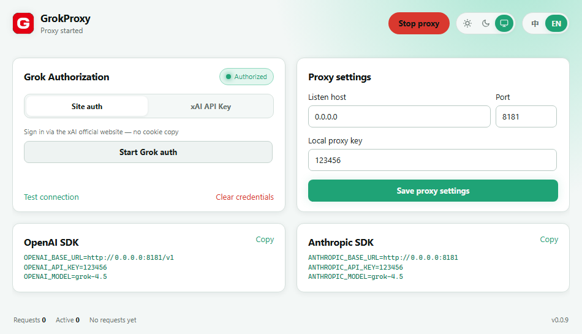

# GrokProxy

English | [简体中文](README.md)

GrokProxy — Expose OpenAI & Anthropic compatible APIs for Grok/xAI, locally on your machine.

Listens on `127.0.0.1:8181` by default; closing the app stops the proxy.



## Features

- **xAI API Key**: connect directly to `api.x.ai`.
- **Grok device authorization**: official xAI OAuth Device Flow with automatic token refresh before expiry.
- `GET /v1/models`
- `POST /v1/chat/completions`: OpenAI JSON / SSE, image input, function tools, and reasoning fields.
- `POST /v1/messages`: Anthropic JSON / SSE, system, images, tool calls, and thinking.
- A 16-character local proxy key is generated by default, persisted in config, and required by clients.

## Download

Get the desktop app for your platform from [Releases](../../releases):

| Platform | File |
| --- | --- |
| Windows x64 | `GrokProxy-*-windows-amd64.exe` |
| Windows ARM64 | `GrokProxy-*-windows-arm64.exe` |
| macOS Intel | `GrokProxy-*-darwin-amd64.app.zip` |
| macOS Apple Silicon | `GrokProxy-*-darwin-arm64.app.zip` |

On macOS, if Gatekeeper blocks the first launch, right-click the app in Finder and choose **Open**, or allow it under **System Settings → Privacy & Security**.

## Usage

1. Open GrokProxy.
2. Use **Site auth** to sign in to Grok, or switch to **xAI API Key** and paste a key.
3. Keep the default listen address and start the proxy.
4. Point your client's Base URL at the local address shown in the UI.

### OpenAI compatible

```bash
export OPENAI_BASE_URL="http://127.0.0.1:8181/v1"
export OPENAI_API_KEY="<LOCAL_PROXY_KEY>"
export OPENAI_MODEL="grok-4.5"
```

```bash
curl http://127.0.0.1:8181/v1/chat/completions \
  -H "Content-Type: application/json" \
  -H "Authorization: Bearer <LOCAL_PROXY_KEY>" \
  -d '{"model":"grok-4.5","messages":[{"role":"user","content":"Hello"}]}'
```

### Anthropic compatible

```bash
export ANTHROPIC_BASE_URL="http://127.0.0.1:8181"
export ANTHROPIC_API_KEY="<LOCAL_PROXY_KEY>"
export ANTHROPIC_MODEL="grok-4.5"
```

```bash
curl http://127.0.0.1:8181/v1/messages \
  -H "Content-Type: application/json" \
  -H "anthropic-version: 2023-06-01" \
  -H "x-api-key: <LOCAL_PROXY_KEY>" \
  -d '{"model":"grok-4.5","max_tokens":512,"messages":[{"role":"user","content":"Hello"}]}'
```

Use the local proxy key from the **Proxy settings** panel as `<LOCAL_PROXY_KEY>`. OpenAI requests use `Authorization: Bearer <key>`; Anthropic requests may use `x-api-key: <key>`.

## Configuration & security

Configuration is stored in the user config directory:

- Windows: `%AppData%\GrokProxy\config.json`
- macOS: `~/Library/Application Support/GrokProxy/config.json`
- Linux: `$XDG_CONFIG_HOME/GrokProxy/config.json` or `~/.config/GrokProxy/config.json`

A local proxy key is generated on first launch and written to config; it cannot be empty, and the same key is reused on later starts.
