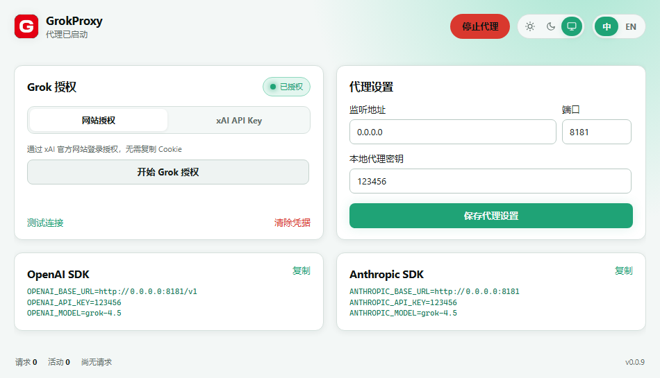

# GrokProxy

[English](README.en.md) | 简体中文

GrokProxy — 在本地为 Grok/xAI 提供 OpenAI 与 Anthropic 兼容 API。

默认监听 `127.0.0.1:8181`，关闭程序即停止代理。



## 能力

- **xAI API Key**：直接连接 `api.x.ai`。
- **Grok 设备授权**：使用 xAI 官方 OAuth Device Flow，令牌到期前自动刷新。
- `GET /v1/models`
- `POST /v1/chat/completions`：OpenAI JSON / SSE、图片输入、函数工具与推理字段。
- `POST /v1/responses`：原生 OpenAI Responses JSON / SSE 透传，保留图片与工具输出结构。
- `POST /v1/responses/compact`：原生 Responses 非流式上下文压缩透传。
- `POST /v1/messages`：Anthropic JSON / SSE、system、图片、工具调用与 thinking。
- 默认生成 16 位本地代理密钥，并持久化到配置；客户端请求需携带该密钥。

## 下载

从 [Releases](../../releases) 下载对应平台的桌面程序：

`v0.0.10` 起包含原生 OpenAI Responses、Responses Compact、图片与结构化工具输出透传。当前 fork 的 Windows x64 文件为 `GrokProxy-v0.0.10-windows-amd64.exe`。

| 平台 | 文件 |
| --- | --- |
| Windows x64 | `GrokProxy-*-windows-amd64.exe` |
| Windows ARM64 | `GrokProxy-*-windows-arm64.exe` |
| macOS Intel | `GrokProxy-*-darwin-amd64.app.zip` |
| macOS Apple Silicon | `GrokProxy-*-darwin-arm64.app.zip` |

macOS 首次打开若被拦截，可在访达中右键应用选择「打开」，或在「系统设置 → 隐私与安全性」中允许。

## 使用

1. 打开 GrokProxy。
2. 使用「网站授权」登录 Grok，或切换到「xAI API Key」填写密钥。
3. 保持默认监听地址并启动代理。
4. 把客户端的 Base URL 指向界面展示的本地地址。

### OpenAI 兼容

Codex 等原生 Responses 客户端建议直接使用 `http://127.0.0.1:8181/v1` 作为 Base URL，避免在 Responses 与 Chat Completions 之间重复转换。

```bash
export OPENAI_BASE_URL="http://127.0.0.1:8181/v1"
export OPENAI_API_KEY="<LOCAL_PROXY_KEY>"
export OPENAI_MODEL="grok-4.5"
```

```bash
curl http://127.0.0.1:8181/v1/responses \
  -H "Content-Type: application/json" \
  -H "Authorization: Bearer <LOCAL_PROXY_KEY>" \
  -d '{"model":"grok-4.5","input":"Hello"}'
```

```bash
curl http://127.0.0.1:8181/v1/chat/completions \
  -H "Content-Type: application/json" \
  -H "Authorization: Bearer <LOCAL_PROXY_KEY>" \
  -d '{"model":"grok-4.5","messages":[{"role":"user","content":"Hello"}]}'
```

### Anthropic 兼容

```bash
export ANTHROPIC_BASE_URL="http://127.0.0.1:8181"
export ANTHROPIC_API_KEY="<LOCAL_PROXY_KEY>"
export ANTHROPIC_MODEL="grok-4.5"
```

```bash
curl http://127.0.0.1:8181/v1/messages \
  -H "Content-Type: application/json" \
  -H "anthropic-version: 2023-06-01" \
  -H "x-api-key: <LOCAL_PROXY_KEY>" \
  -d '{"model":"grok-4.5","max_tokens":512,"messages":[{"role":"user","content":"Hello"}]}'
```

`<LOCAL_PROXY_KEY>` 使用界面「代理设置」中的本地代理密钥。OpenAI 请求使用 `Authorization: Bearer <key>`，Anthropic 请求可使用 `x-api-key: <key>`。

## 配置与安全

配置保存在系统用户配置目录：

- Windows：`%AppData%\GrokProxy\config.json`
- macOS：`~/Library/Application Support/GrokProxy/config.json`
- Linux：`$XDG_CONFIG_HOME/GrokProxy/config.json` 或 `~/.config/GrokProxy/config.json`

本地代理密钥首次启动时自动生成并写入配置；不能为空，下次启动会继续使用同一密钥。
